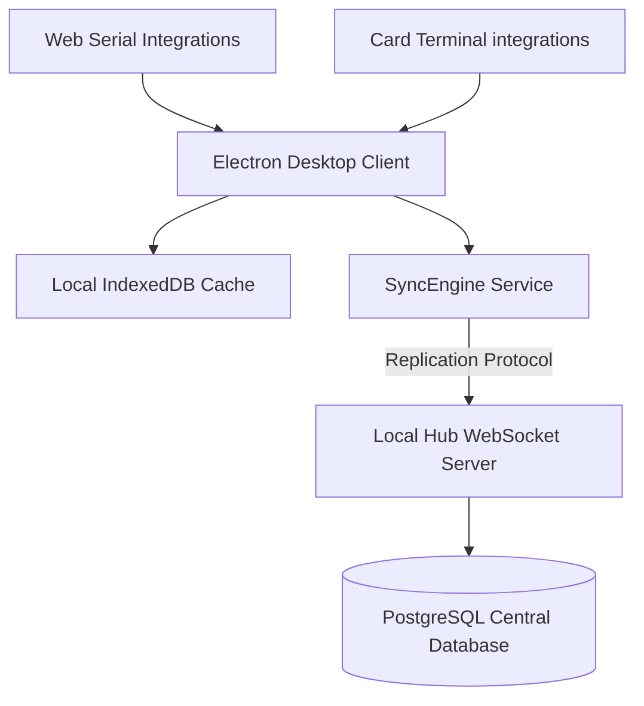

# 🏢 Enterprise POS & ERP Lite System

> A premium, features-rich, local-first Point of Sale (POS) and Enterprise Resource Planning (ERP) platform designed for high-performance multi-branch retail and restaurant operations. Built for speed, offline resilience, stunning aesthetics, and deep analytical compliance.

---

## 🚀 Key Modules & Capabilities

### 🛒 Point of Sale (POS) & Billing Hub
*   **Smart Split Payments:** Enable split payments between Cash, Card, UPI, and Wallet with dynamic, real-time auto-balancing of balance dues.
*   **Credit Sales & Ledger Management:** Issue credit sales to registered customers, enforce custom credit limits, and view fully printable ledger accounts.
*   **Dynamic Variant Matrix:** Sell items by colors, sizes, weights, or categories with instant variant-level pricing and SKU updates.
*   **Interactive Floor & Table Mapping:** Full visual layout mapping for dining zones, table cards, occupancy state trackers, and a comprehensive PAX selector.

### 🏢 Enterprise & Multi-Branch Control
*   **Data & Branch Isolation:** Secure multi-location management where branches have isolated inventories, distinct sales registers, and assigned staff.
*   **Granular Role-Based Access Control (RBAC):** Restrict system views with pre-defined or custom permissions for standard Staff, Managers, Admins, and Master (System Owner) accounts.
*   **Register & Shift Auditing:** Secure shift openers and closers with cash denomination trackings, manual cash-in/out logging, and automatic closing slip prints.

### 📦 Procurement & Intelligent Inventory
*   **Purchase Intake Module:** Register stock intakes with supplier tax invoice IDs, track unit landing costs, and pre-populate Input Tax Credit (ITC) balances.
*   **Supplier Directory:** Track vendors with integrated GSTIN profiles, procurement logs, and payment histories.
*   **Real-Time Stock Safeguards:** Instant transactional checks prevent selling out-of-stock items, complete with automated low-stock warnings.

### 🧾 GST Compliance & Reporting
*   **GSTR-1 Ready Sales Export:** One-click JSON generation for immediate sales uploads (supporting B2B, B2CS, and HSN-wise summary tables).
*   **GSTR-2B Ready Purchase Ledger:** Formatted exports for rapid Input Tax Credit (ITC) reconciliation.
*   **Intelligent Tax Splitting:** Automatic classification and calculation of CGST, SGST, and IGST based on customer and branch location states.

---

## ⚙️ Advanced System Architecture

The application implements a hybrid **Local-First, Cloud-Synced architecture** to guarantee zero downtime, even during complete internet blackouts.



### 1. Offline SyncEngine
*   Executes in a background loop, maintaining a robust Local Hub synchronization interface over WebSockets.
*   Automatically queues local CRUD operations when offline, pushing data streams to the primary PostgreSQL central hub immediately upon connection recovery.
*   Includes built-in ID type-mismatch recovery routines to protect against SQLite/IndexedDB auto-increment overrides.

### 2. Device & Hardware Integrations
*   **Weight Scale Web Serial Bridge:** Directly interfaces with physical weighing scales using the RS-232 serial protocol (supports Toledo, CAS, and Generic serial weight output protocols).
*   **Card Reader API Bridge:** Integrated communication framework supporting Razorpay, Paytm POS Android bridges, and local simulators.

### 3. Desktop Manual Update Mechanism
*   Designed for fully offline or air-gapped corporate environments.
*   Replaces the legacy remote GitHub autoupdater with an **IPC-driven local ZIP selector**.
*   Utilizes a high-performance **7-Zip / extract-zip extraction subsystem** requesting elevated administrator permissions during update packaging.
*   Features a premium visual "Preparing Installation" loader overlay to display progress during resource swapping and app restarts.

### 4. WordPress Plugin & MySQL Sync Engine
*   **Fully Autonomous WordPress Integration:** Generates a complete, standard WordPress plugin that packages the entire high-performance POS console inside the WordPress admin page and standard pages.
*   **Native MySQL Database Sync:** Automatically creates and synchronizes all POS registers, products, categories, orders, customers, and staff to the WordPress database (`wp_zeinfotech_pos`) over secure custom WP-REST API endpoints (`/wp-json/zeinfotech-pos/v1/sync`).
*   **Dual Authentication Pipeline:** Features a fallback login structure authenticating credentials first against the POS users database, and then falling back to native WordPress users (`wp_authenticate`), allowing immediate secure POS logins using standard WP administrator logins.

---

## 🛠️ Technology Stack

| Component | Technology | Description |
| :--- | :--- | :--- |
| **Desktop Wrapper** | Electron (v30+) | OS integrations, hardware port controls, IPC bridges |
| **Frontend Core** | Vanilla JS (ES6+), HTML5 | Lightning fast rendering, low memory usage |
| **Styling** | Modern Vanilla CSS3 | Custom themes, glassmorphism, responsive grids |
| **State & Storage** | IndexedDB, Dexie.js | Rich local caching, offline persistence |
| **Replication Server**| Node.js, Express, ws | WebSocket synchronization, PostgreSQL adapters |
| **Build & Tooling** | Vite (v7+) | Ultra-fast bundling and module compilation |

---

## 🧪 Testing Infrastructure & Automation

We maintain an aggressive testing standard covering both internal business logic (Unit) and complete interface rendering flow (E2E).

### 1. Unit & Component Verification (Vitest)
Powered by **Vitest** under a simulated `jsdom` browser environment:
*   Tests critical calculations like **Cart Operations**, **Coupon Stacking**, and **Tax Splits**.
*   Unit-tests the Weight Scale serial-output parser directly (Toledo/CAS continuous-output framing and plain generic numeric lines) — no mocked IPC bridge needed since the parsing logic lives in its own dependency-free module.
*   Tests UI components (Toasts, Modals, Customer Registration Forms) to ensure strict DOM interaction integrity.
*   Run the unit suite via:
    ```bash
    npm run test:unit
    ```

### 2. Deep End-to-End Testing (Playwright + Electron)
Powered by **Playwright** interfacing directly with the live Electron executable:
*   Includes **41 deep verification specs** covering every view, form validation, search bar, and CRUD modal.
*   **IndexedDB State Isolation:** Automatically opens raw database locks and forces state overrides to bypass Settings Locks during CI builds, preventing tests from hanging on security screens.
*   Run the E2E suite via:
    ```bash
    npm run test:deep
    ```

---

## 🔧 Developer Setup & Deployment

### Prerequisites
*   Node.js (v20+ recommended)
*   Git configured with SSH

### 1. Local Web Development
To run and iterate on the UI in a standard browser:
```bash
# Clone the repository
git clone git@github.com:zeinfotech-create/pos.git

# Install dependencies
npm install

# Run the local Vite dev server
npm run dev
```

### 2. Running the Electron App
To launch the desktop interface with complete hardware and IPC features enabled:
```bash
# Compile client assets and boot Electron
npm run electron:start
```

### 3. Packaging & Distribution
To package a standalone executable (`.exe`) optimized for offline installer rollouts:
```bash
# Build the production bundle and package via Electron Builder
npm run build
npm run package
```

### 4. WordPress Plugin Compilation
To build and package a native, zip-installable WordPress plugin backed by local MySQL database synchronization:
```bash
# Build Vite production assets, generate loader, and package as a standard wordpress.zip plugin
npm run wordpress
```
*   **Deployment:** Upload the generated `wordpress.zip` directly to any standard WordPress site (`Plugins > Add New > Upload Plugin`), activate it, and access the fullscreen premium POS console by opening the `ZeInfoTech POS` admin sidebar tab or adding the `[zeinfotech_pos]` shortcode to any post or page.

---

## 🗝️ System Configurations & Security

### Settings Security Lock
The Settings Dashboard supports an absolute **Master PIN lock**. When activated (`settingsLockEnabled: true`), access to core configuration modules is locked behind a secure passcode keypad modal, preventing unauthorized terminal changes by cashier staff.

### Database Backups
*   **Automated Hub Backups:** The SyncEngine triggers periodic automated database snapshots saved safely inside the cloud PostgreSQL storage.
*   **Manual Recovery:** Local operators can generate local binary snapshots via `Settings > Backup`, allowing instant recovery in the event of hardware failure.

---

*Built with ❤️ by [ZE Infotech](mailto:zeinfotech@gmail.com). For commercial support, custom hardware profiles, or enterprise volume licensing, contact our systems delivery desk.*